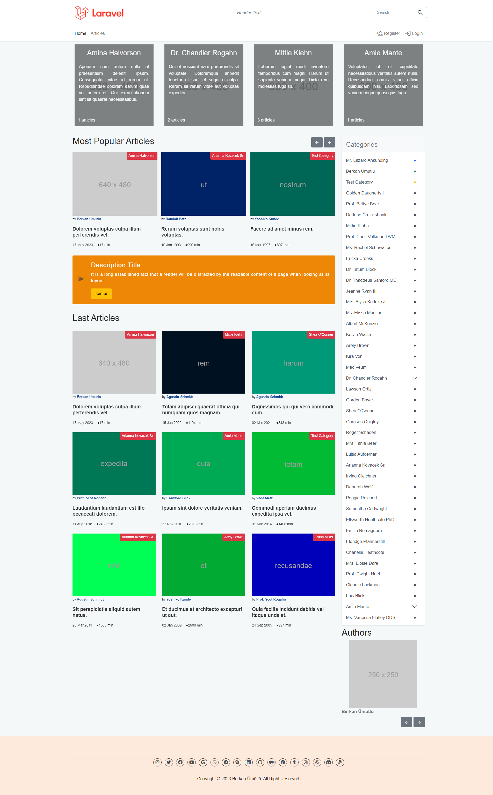
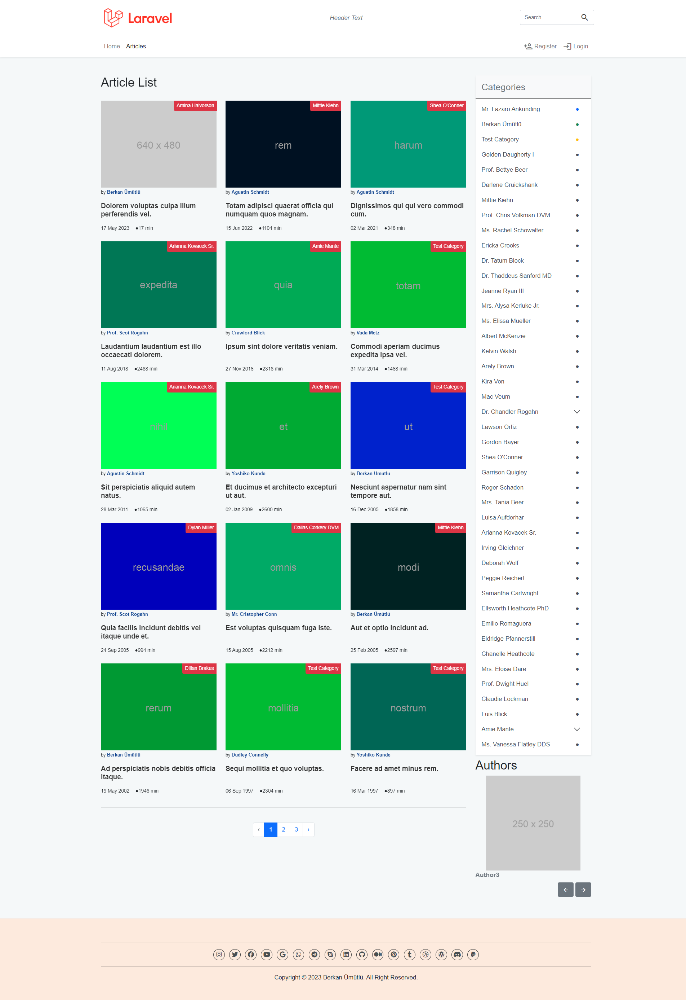
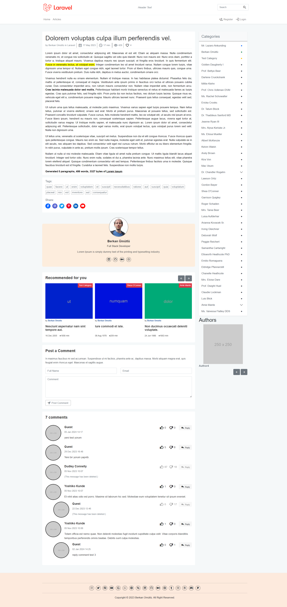
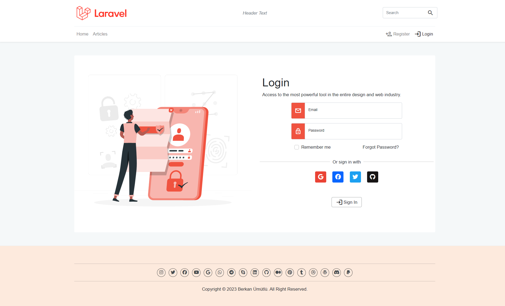
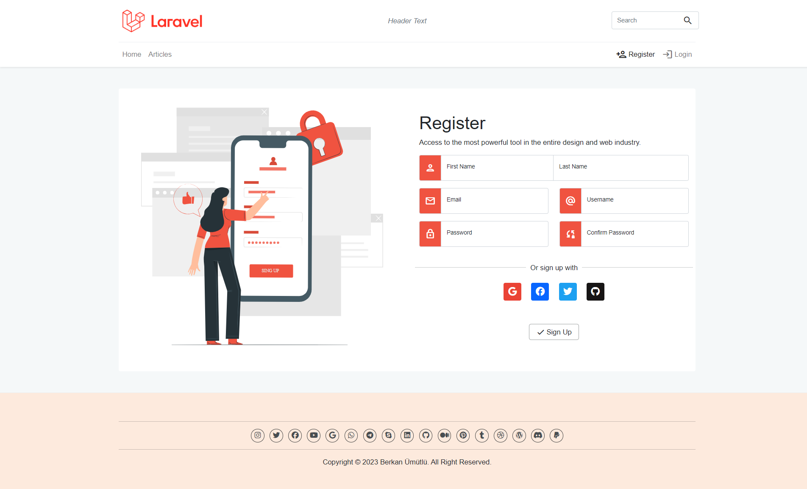
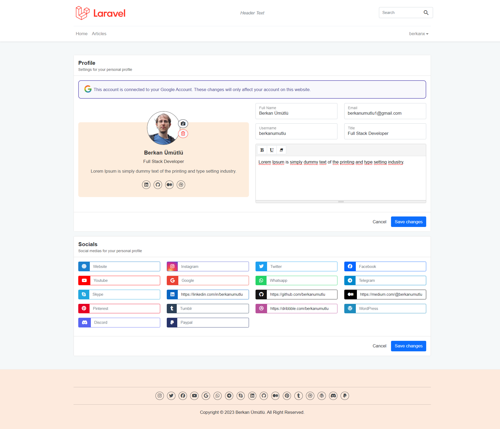
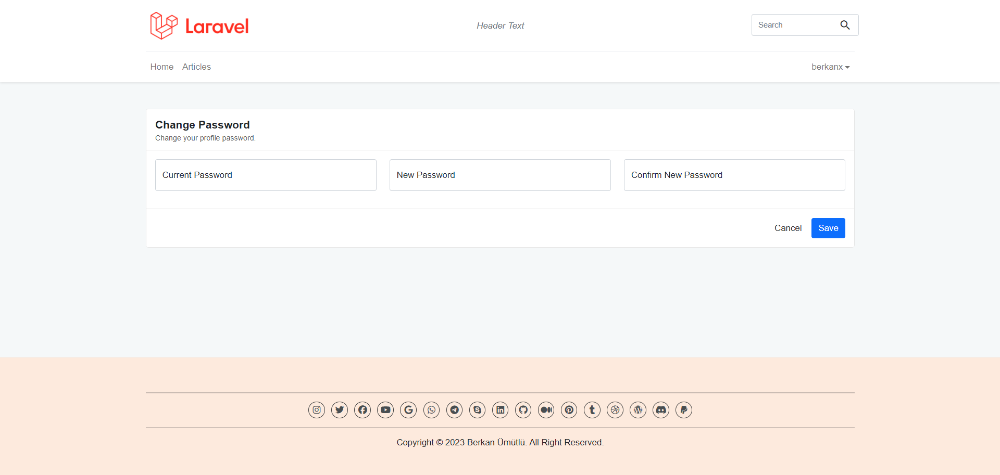

<p align="center"><a href="https://laravel.com" target="_blank" rel="nofollow"></a></p>

<p align="center">
<a href="https://github.com/berkanumutlu/laravel-example-app/releases/tag/v1.0.0" target="_blank" rel="nofollow"></a>
<a href="https://github.com/berkanumutlu/laravel-example-app/stargazers" rel="nofollow"></a>
<a href="https://github.com/berkanumutlu/laravel-example-app/blob/master/LICENSE" target="_blank" rel="nofollow"></a>
<a href="https://laravel.com/docs/10.x" target="_blank" rel="nofollow"></a>
<a href="https://www.php.net/releases/8_1_23.php" target="_blank" rel="nofollow"></a>
<a href="https://getcomposer.org" target="_blank" rel="nofollow"></a>
<a href="https://www.docker.com" target="_blank" rel="nofollow"></a>
</p>
<p align="center">
<a href="https://getbootstrap.com/docs/5.0/getting-started/introduction" target="_blank" rel="nofollow"></a>
<a href="https://blog.jquery.com/2020/05/04/jquery-3-5-1-released-fixing-a-regression" target="_blank" rel="nofollow"></a>
<a href="https://animate.style" target="_blank" rel="nofollow"></a>
<a href="https://michalsnik.github.io/aos" target="_blank" rel="nofollow"></a>
<a href="https://apexcharts.com" target="_blank" rel="nofollow"></a>
<a href="http://jquery.malsup.com/block" target="_blank" rel="nofollow"></a>
<a href="https://johann-s.github.io/bs-stepper" target="_blank" rel="nofollow"></a>
<a href="https://www.chartjs.org" target="_blank" rel="nofollow"></a>
<a href="https://hilios.github.io/jQuery.countdown" target="_blank" rel="nofollow"></a>
<a href="https://www.dropzone.dev" target="_blank" rel="nofollow"></a>
<a href="https://flatpickr.js.org/" target="_blank" rel="nofollow"></a>
<a href="https://fontawesome.com" target="_blank" rel="nofollow"></a>
<a href="https://fullcalendar.io" target="_blank" rel="nofollow"></a>
<a href="https://highlightjs.org" target="_blank" rel="nofollow"></a>
<a href="https://thorst.github.io/jquery-idletimer" target="_blank" rel="nofollow"></a>
<a href="https://robinherbots.github.io/Inputmask" target="_blank" rel="nofollow"></a>
<a href="https://blog.jqueryui.com/2022/07/jquery-ui-1-13-2-released" target="_blank" rel="nofollow"></a>
<a href="https://afarkas.github.io/lazysizes" target="_blank" rel="nofollow"></a>
<a href="https://fslightbox.com" target="_blank" rel="nofollow"></a>
<a href="https://marella.me/material-icons/demo" target="_blank" rel="nofollow"></a>
<a href="https://codebyzach.github.io/pace" target="_blank" rel="nofollow"></a>
<a href="https://perfectscrollbar.com" target="_blank" rel="nofollow"></a>
<a href="https://markgoodyear.com/labs/scrollup" target="_blank" rel="nofollow"></a>
<a href="https://select2.org" target="_blank" rel="nofollow"></a>
<a href="https://summernote.org" target="_blank" rel="nofollow"></a>
<a href="https://vadimsva.github.io/waitMe" target="_blank" rel="nofollow"></a>
</p>

# Laravel Example App

It is an article publishing web project using Laravel. There is an admin panel within the project. In the admin panel, administrators and users can be created, articles can be added, edited and deleted, categories can be added, edited and deleted, and categories can be assigned to articles. On the web side, users can view the list of articles, filter by categories, and comment on articles.

## Installation

```sh
$ docker-compose up
$ docker ps
$ docker exec -it {PHP8_CONTAINER_ID} bash
```

```sh
$ composer global require laravel/installer
```

```sh
$ composer global about
# Changed current directory to /root/.composer
# Composer - Dependency Manager for PHP - version 2.6.5
# Composer is a dependency manager tracking local dependencies of your projects and libraries.
# See https://getcomposer.org/ for more information.
```

```sh
$ export PATH="/root/.composer/vendor/bin:$PATH"
```

```sh
$ laravel new project
```

```sh
$ cd project
$ php artisan serve
```

## Screenshots










## License

The MIT License (MIT). Please see [License File](LICENSE) for more information.
